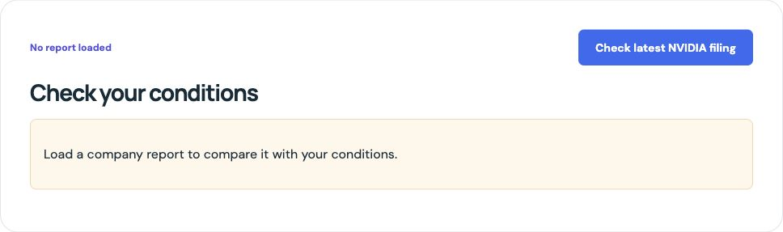

# Filing button visibility — 4 October 2026

The result page's filing action is now a filled primary button rather than a
small text link. Its minimum target height is 44px; at widths of 640px or less
it spans its row. Initial check, refresh and retry retain their existing labels
and handlers. Pending work remains disabled and exposes `aria-busy`. No automatic
retrieval, AI behavior, numerical rule or saved notebook was changed.

Manual conditions still require judgement: a qualitative peer comparison or
claim that no regulatory issue exists cannot be established by comparing one
number in an earnings report. This change does not mark such claims as proven.

## Verification

- 119 frontend tests passed, including six new button-state/handler tests.
- TypeScript, Prettier, production build and `git diff --check` passed.
- Existing build warnings remain: large JS chunk and Zod annotations.
- The actual React component and CSS were rendered in a temporary loopback-only
  static preview, without API calls, notebook access or a usable AI client.
- Desktop target measured 44.5px high with a filled blue background. At 390px,
  the button and its container both measured 312px; page width remained 390px.
- Temporary viewport was reset and preview server/tab closed. User test servers
  remain running. No paid calls, commit, push or deployment were made.

## Complete Desloppify scores

Only `apps/web` changed and was scanned before/after, with status and next.
The skill guided scoped verification and preservation of existing action guards;
no unrelated cleanup, exclusions, suppression or invented subjective review.
Remaining 72 findings and broad review work are unchanged. Backend was not changed
or rescanned in this UI-only task.

| Web score | Before | After |
| --- | ---: | ---: |
| Overall, lenient | 21.9 | 21.9 |
| Objective | 87.8 | 87.8 |
| Strict | 20.5 | 20.5 |
| Verified | 87.8 | 87.8 |

| Mechanical dimension | Health before → after | Strict before → after |
| --- | ---: | ---: |
| Code quality | 97.1 → 97.1 | 95.5 → 95.5 |
| Duplication | 100 → 100 | 100 → 100 |
| File health | 98.8 → 98.8 | 98.8 → 98.8 |
| Security | 100 → 100 | 100 → 100 |
| Test health | 57.7 → 57.8 | 37.2 → 37.3 |

Subjective zeros mean **unassessed**, not a completed design-quality review.

| Subjective dimension | Before / after |
| --- | --- |
| Abstraction fitness | 0 / 0 — unassessed |
| AI-generated debt | 0 / 0 — unassessed |
| API surface coherence | 0 / 0 — unassessed |
| Authorization consistency | 0 / 0 — unassessed |
| Contract coherence | 0 / 0 — unassessed |
| Convention outlier | 0 / 0 — unassessed |
| Cross-module architecture | 0 / 0 — unassessed |
| Dependency health | 0 / 0 — unassessed |
| Design coherence | 0 / 0 — unassessed |
| Error consistency | 0 / 0 — unassessed |
| High-level elegance | 0 / 0 — unassessed |
| Incomplete migration | 0 / 0 — unassessed |
| Initialization coupling | 0 / 0 — unassessed |
| Logic clarity | 0 / 0 — unassessed |
| Low-level elegance | 0 / 0 — unassessed |
| Mid-level elegance | 0 / 0 — unassessed |
| Naming quality | 0 / 0 — unassessed |
| Package organization | 0 / 0 — unassessed |
| Test strategy | 0 / 0 — unassessed |
| Type safety | 0 / 0 — unassessed |
