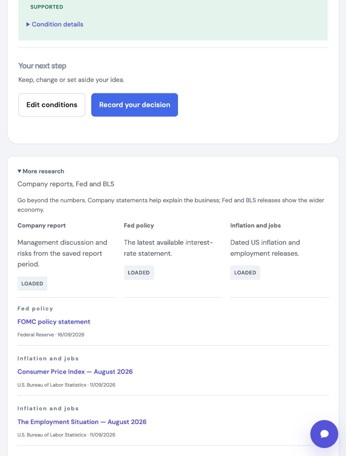

# Official research — local verification, 4 October 2026

## Outcome

Three optional source groups are implemented under the collapsed **More research**
section: company-report passages from SEC, Federal Reserve policy statements,
and BLS inflation/jobs releases. The six-company picker is unchanged. Further
xStocks ingestion remains paused; existing outgoing reading links are preserved.

Loading public sources makes no AI call. A new immutable check keeps the saved
filing and quote, rechecks source age, and records the new sources and failures.
Sources are newest first. Chat, explanations, the source drawer and exports can
use saved passages. Numerical comparisons still use company financial facts
only. Economy-wide sources cannot establish company performance or fill missing
numbers. Company commentary is not independently verified evidence.

Implementation and setup details: [Official research](../OFFICIAL_RESEARCH.md).

## Checks actually performed

| Check | Result |
| --- | --- |
| Backend test suite | 183 passed; two existing framework deprecation warnings |
| Frontend test suite | 113 passed; existing local-storage runtime warning |
| Ruff lint and format | Passed, 58 files formatted |
| TypeScript and Prettier | Passed |
| Production frontend build | Passed; existing large-chunk and Zod annotation warnings remain |
| Dependency lock verification | `uv lock --check` passed using the existing cache |
| Diff whitespace check | Passed |
| Direct Bandit security audit | Two existing low-severity subprocess findings in `backend/providers.py`; no finding in the new source modules |
| Desktop browser | Collapsed default, load, dated saved sources, source drawer and reload checked |
| Mobile browser, 390 × 844 | Sources stack; document width equals viewport width (390px) |

New tests cover all six synthetic issuer mappings, allowed paths and SSRF
rejection, redirects/content types, decoded size/time limits, malformed XML,
DTD/entity rejection, hidden HTML, publication/reference dates, revised BLS page
availability, period binding, ambiguous sections, no older fallback, partial
failures, shared bounded caches and stale-source filtering. API tests cover
authentication/CSRF, cross-owner access, immutable history, atomic selection
conflicts, SQLite restart, saved-source lookup, Markdown/PDF/JSON exports and
AI citation boundaries. Repair prompts retain those same source boundaries.

These are software tests with synthetic fixtures, not an independent research
benchmark. The user-owned study and 24 pending independent-validation slots were
not conducted or presented as results.

## Public-source probe (no AI)

The actual provider loaded the newest available Fed statement and both BLS
summary pages from this machine on 4 October 2026:

| Group | Observed result |
| --- | --- |
| Federal Reserve | Available; statement published 16 September 2026 at 18:00 UTC; selected opening 843 characters |
| BLS jobs | Available; September 2026 release published 2 October 2026 at 08:30 America/New_York |
| BLS inflation | Available; August 2026 release published 11 September 2026 at 08:30 America/New_York |
| SEC passages | Unavailable: no genuine `REVISO_SEC_USER_AGENT` contact was configured; live retrieval was not verified |

The full BLS pages exceeded the deliberate 1 MB document limit. The provider now
uses the smaller official summary pages rather than raising that limit. No
access-control bypass or retry loop was added. BLS may still reject requests
from another environment; failure is surfaced honestly.

SEC needs an application name and an actual contact address in server `.env`.
A personal email is sufficient; no API key or work-email account is required.
Restart the backend after setting it. Six-company SEC behavior was tested with
fixtures, not claimed as a new live-source accuracy result.

## Visual evidence

Screenshots use a disposable SQLite notebook and **synthetic test data**, not
current investment research. Its injected language model was unavailable; no
paid request could occur. Loaded source drawers, persistence after reload and
mobile overflow were inspected. Existing notebooks/accounts were not changed.

[Mobile screenshot](2026-10-04-official-research-mobile.jpg).

## Desloppify — complete score disclosure

Backend and web were scanned separately before implementation and again after
it, with `status` and `next` reviewed. Scores are software-health indicators,
not research-accuracy grades. The 20 subjective dimensions remain **unassessed**
and are represented by zero; this makes overall/strict figures misleading if
read as a completed review. No subjective assessment was invented, no findings
were suppressed, and no questionable exclusion was added.

| Project / point | Overall (lenient) | Objective | Strict | Verified | Open |
| --- | ---: | ---: | ---: | ---: | ---: |
| Backend before | 23.1 | 92.4 | 22.0 | 92.4 | 71 |
| Backend after | 23.0 | 92.0 | 22.0 | 92.0 | 83 |
| Web before | 21.8 | 87.2 | 20.3 | 87.2 | 71 |
| Web after | 21.9 | 87.8 | 20.5 | 87.8 | 72 |

| Mechanical dimension | Backend health before → after | Backend strict before → after | Web health before → after | Web strict before → after |
| --- | ---: | ---: | ---: | ---: |
| Code quality | 89.1 → 88.8 | 85.4 → 84.9 | 97.2 → 97.1 | 95.6 → 95.5 |
| Duplication | 100 → 100 | 100 → 100 | 100 → 100 | 100 → 100 |
| File health | 86.5 → 86.0 | 83.8 → 83.7 | 98.7 → 98.8 | 98.7 → 98.8 |
| Security | 98.8 → 97.3 | 96.5 → 95.3 | 100 → 100 | 100 → 100 |
| Test health | 87.9 → 87.5 | 76.9 → 77.9 | 56.4 → 57.7 | 35.2 → 37.2 |

| Subjective dimension | Backend before / after | Web before / after |
| --- | --- | --- |
| Abstraction fitness | 0 / 0 — unassessed | 0 / 0 — unassessed |
| AI-generated debt | 0 / 0 — unassessed | 0 / 0 — unassessed |
| API surface coherence | 0 / 0 — unassessed | 0 / 0 — unassessed |
| Authorization consistency | 0 / 0 — unassessed | 0 / 0 — unassessed |
| Contract coherence | 0 / 0 — unassessed | 0 / 0 — unassessed |
| Convention outlier | 0 / 0 — unassessed | 0 / 0 — unassessed |
| Cross-module architecture | 0 / 0 — unassessed | 0 / 0 — unassessed |
| Dependency health | 0 / 0 — unassessed | 0 / 0 — unassessed |
| Design coherence | 0 / 0 — unassessed | 0 / 0 — unassessed |
| Error consistency | 0 / 0 — unassessed | 0 / 0 — unassessed |
| High-level elegance | 0 / 0 — unassessed | 0 / 0 — unassessed |
| Incomplete migration | 0 / 0 — unassessed | 0 / 0 — unassessed |
| Initialization coupling | 0 / 0 — unassessed | 0 / 0 — unassessed |
| Logic clarity | 0 / 0 — unassessed | 0 / 0 — unassessed |
| Low-level elegance | 0 / 0 — unassessed | 0 / 0 — unassessed |
| Mid-level elegance | 0 / 0 — unassessed | 0 / 0 — unassessed |
| Naming quality | 0 / 0 — unassessed | 0 / 0 — unassessed |
| Package organization | 0 / 0 — unassessed | 0 / 0 — unassessed |
| Test strategy | 0 / 0 — unassessed | 0 / 0 — unassessed |
| Type safety | 0 / 0 — unassessed | 0 / 0 — unassessed |

Desloppify prompted hardened XML parsing (`defusedxml` with DTD/entities/external
resolution forbidden), a typed SEC index/filing contract and smaller transport
validation helpers. Its final backend state still lists the original two XML
security findings even though the code now imports `defusedxml` and the direct
Bandit audit finds neither. The initial scanner lacked Bandit on its PATH; the
final rerun supplied the existing virtual environment, but those recorded items
remained. They were not manually resolved or suppressed to improve the score.

Remaining findings include existing structural/test-health debt, parser
complexity and scanner-reported dictionary flows. The bounded HTML attribute
handling and actual HTTP route tests were inspected; scanner findings do not
establish missing behavior. A broad subjective review and unrelated repository
cleanup remain separate work, not a claimed outcome of this feature.

## Remaining gates

Configure a real SEC contact and verify live report parsing. Review/question
prompts are now v5/v4; they have offline contract coverage but **no authorised
live AI validation** for these new sources. A separately approved frozen batch
is required before claiming live explanation accuracy. No paid call, commit,
push, AWS deployment, migration or existing-database write was made here.
