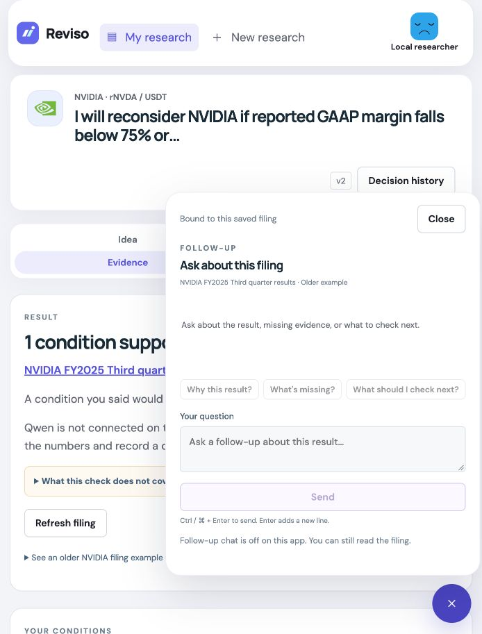

# Research close-out — October 4, 2026

## Scope and authority

The user asked to improve research quality, data/tool integration and natural-language experience, while keeping the small user study for themselves. This was local implementation and verification only. No user study, paid model call, account authorization, commit, push, deployment or external publication occurred. Existing README, export, branding and demo-script work was preserved.

## What changed

| Area | Implemented improvement | Boundary |
| --- | --- | --- |
| Research quality | AI receives the saved code-computed finding and confirmed conditions. Numerical review stances must match that finding and cite its sources; supported/contradicting claims need citations. Repairs retain original context. | Narrative checks are not proof of semantic accuracy. Qualitative claims stay separate from numerical comparisons. |
| Data/tool integration | AI evidence includes publisher, period, publication date, origin, scope and reported metrics. Condition drafts receive issuer-supported metrics; unsupported metrics fail validation. SEC source drawers no longer claim NVIDIA retrieval. | No new source connector, arbitrary browsing or xStocks article ingestion. Bitget USDT quotes and xStocks indicative USD prices remain separate market context. |
| Natural-language experience | Chat displays saved answer facts, uncertainty and dated source links; names the newest included filing; supports Ctrl/Cmd+Enter and safe context changes. Source hashes/parser details start collapsed. A deterministic explanation remains when AI is off or fails. | No live latency improvement or model-quality percentage measured. AI cannot change conditions or record a decision. |

Review reuse now includes the numerical finding plus provider, model and review prompt. Changed missing/stale states invalidate reuse, even for the same source document. A timestamp-only refresh of an unchanged finding need not spend credit. Prompt versions: draft `assumption-suggestion-v3`, review `evidence-review-v4`, follow-up `research-question-v3`; extraction remains v2. Previously saved research stays stored, but changed finding keys may begin a new conversation context.

## Offline verification

- `.venv/bin/python -m pytest -q`: **142 passed** (134 existing plus 8 new research-quality cases).
- `npm test`: **76 passed** (68 existing plus 8 new research-experience cases).
- Ruff check and format check, Prettier check, TypeScript check, production build and `git diff --check`: passed.
- The existing Guide had a formatting-only discrepancy; Prettier wrapped its text without changing content.

The new backend cases check freshness-driven cache invalidation versus timestamp-only reuse; review reversal and missing citations with one repair; stale metrics and separate manual review; fact answers without citations versus explicit abstention; issuer-unsupported draft metrics; and propagation of the exact saved finding through review, questions and conversation. HTTP transports and model responses are injected mocks. They do not call Bitget Qwen or Groq.

The new frontend cases check saved facts, uncertainty and dated source clicks; newest-filing identification; one keyboard submission with a locked pending composer; conversation-fetch failure; an old in-flight failure after context changes; correct SEC provenance with collapsed technical details; and deterministic explanations with unconfigured or failed AI.

Non-fatal warnings remain: two upstream Python TestClient deprecations, Node's test localStorage warning, Zod/Rollup annotation warnings and the existing JavaScript chunk-size warning (roughly 531 KB minified / 163 KB gzip). No formal accessibility certification, multi-engine browser matrix or bundle-optimization claim is made.

## Disposable browser check

Used the built frontend at `http://127.0.0.1:8034`, explicit local identity, blank Bitget/Groq keys and a fresh temporary SQLite database. It did not touch the user's normal database or Google account.

Observed: public landing → empty library → six-company picker → manual NVIDIA idea/risk inputs → margin floor 75% and growth floor 80% → saved draft → explicit confirmation → older Q3 replay. The result showed one supported condition and one that did not hold, with a readable deterministic explanation despite AI being off. The source dialog showed the preserved excerpt, publisher, publication date, period ended and limitations, with hashes/parser details collapsed. Closing returned focus to the source control. Deep-link reload retained the research.

The browser caught a chat caption naming Q2 instead of Q3 when both sources were included. It was corrected to name the newest included filing and verified after rebuilding/reloading; a regression test covers it. The 390×844 evidence and open-chat layouts had document width 390 (no horizontal overflow); disabled chat explained the missing provider and kept the filing readable. The viewport override was reset afterward. Live response text and latency were not browser-tested.

## Desloppify results

Scanned `backend` with Python from the root and `apps/web` with TypeScript from that application directory, with `status` and `next`. Only dependency/build/cache output was excluded. No suppressions, exclusions of application code, fabricated reviews or wontfix decisions were added. Scores are tool outputs, **not hackathon points, accuracy or runtime test coverage**.

| Project / milestone | Overall lenient | Objective | Strict | Verified | Open |
| --- | ---: | ---: | ---: | ---: | ---: |
| Backend before work | 23.1 | 92.3 | 21.9 | 92.3 | 71 |
| Backend first implementation scan | 23.1 | 92.3 | 22.0 | 92.3 | 73 |
| Backend final scan | 23.1 | 92.4 | 22.0 | 92.4 | 71 |
| Web before work | 21.2 | 84.8 | 19.0 | 84.8 | 74 |
| Web first implementation scan | 21.2 | 84.9 | 19.1 | 84.9 | 75 |
| Web after test cleanup | 21.2 | 84.9 | 19.1 | 84.9 | 74 |
| Web final browser-fix scan | 21.2 | 84.9 | 19.1 | 84.9 | 74 |

Mechanical cells below are **health / strict**.

| Dimension | Backend before | Backend first | Backend final | Web before | Web first / after cleanup | Web final |
| --- | --- | --- | --- | --- | --- | --- |
| Code quality | 88.7 / 85.5 | 88.8 / 85.4 | 89.1 / 85.4 | 96.4 / 94.8 | 96.4 / 94.7 | 96.4 / 94.7 |
| Duplication | 100 / 100 | 100 / 100 | 100 / 100 | 99.4 / 96.9 | 99.4 / 96.9 | 99.4 / 96.9 |
| File health | 86.0 / 83.2 | 86.5 / 83.8 | 86.5 / 83.8 | 98.6 / 97.2 | 98.6 / 97.2 | 98.6 / 97.2 |
| Security | 98.8 / 96.4 | 98.8 / 96.5 | 98.8 / 96.5 | 100 / 100 | 100 / 100 | 100 / 100 |
| Test health | 87.8 / 76.5 | 87.9 / 76.9 | 87.9 / 76.9 | 50.4 / 23.1 | 50.7 / 23.6 | 50.8 / 23.7 |

All subjective dimensions below stayed **0 / 0 (unassessed)** in both projects at every milestone. `next` still requests that review. The repository's cutoff plan excludes independent subjective review; it was not performed or fabricated.

| Subjective dimension | Backend health / strict | Web health / strict |
| --- | --- | --- |
| Abstraction fit | 0 / 0 | 0 / 0 |
| AI-generated debt | 0 / 0 | 0 / 0 |
| API coherence | 0 / 0 | 0 / 0 |
| Authorization consistency | 0 / 0 | 0 / 0 |
| Contract coherence | 0 / 0 | 0 / 0 |
| Convention outlier | 0 / 0 | 0 / 0 |
| Cross-module architecture | 0 / 0 | 0 / 0 |
| Dependency health | 0 / 0 | 0 / 0 |
| Design coherence | 0 / 0 | 0 / 0 |
| Error consistency | 0 / 0 | 0 / 0 |
| High-level elegance | 0 / 0 | 0 / 0 |
| Incomplete migration | 0 / 0 | 0 / 0 |
| Initialization coupling | 0 / 0 | 0 / 0 |
| Logic clarity | 0 / 0 | 0 / 0 |
| Low-level elegance | 0 / 0 | 0 / 0 |
| Mid-level elegance | 0 / 0 | 0 / 0 |
| Naming quality | 0 / 0 | 0 / 0 |
| Package organization | 0 / 0 | 0 / 0 |
| Test strategy | 0 / 0 | 0 / 0 |
| Type safety | 0 / 0 | 0 / 0 |

New findings were a loose type contract and excessive branching in the review validator, plus a low-confidence test literal warning. Typed finding payloads, a cohesive numerical-review validator and an assertion derived from the fixture's date resolved all three in subsequent scans; no findings were manually suppressed. Tiny strict subdimension declines remain visible rather than replaced with better numbers. Existing structural, typing, coverage-heuristic and SDK subprocess findings remain. Python security coverage is reduced because Bandit is not installed; the scanner's backend LOC counter also reports zero despite inspecting 26 files. Security/test scores must be read with these limitations.

## Remaining release proof

1. **User-owned small study:** leave its work and findings to the user.
2. **Paid-call check completed after approval:** one editable draft, one mixed-evidence review and one cited follow-up passed with 3/6 provider requests. See [the frozen live report](final-ai-2026-10-04b/REPORT.md) for outputs, times and limitations. Old v2 passes were not reused as current proof.
3. **Release:** the user approved commit/push and SQLite backup. The local backup passed integrity checking. Production backup is blocked by expired non-root access/SSH timeout; deployment and a signed-in live walkthrough remain pending and were not authorized in this turn.
4. **Submission:** use the dated evidence in the description, then record the final demo, publish the required X post and submit only when approved. October 8 is the user-supplied working date; finish by October 7 Lagos without assuming an unverified cutoff hour.

The earlier illustrative 78/100 estimate is not an official or measured score. This report makes no replacement grade or promise of maximum points.

## Newest-first library follow-up — October 4

Saved research now sorts by its original creation time, descending, rather than the insertion order of its latest version. Revising an older study therefore does not move it above newer research. Two regression cases cover normal and reversed insertion/date order, editing the older record, keeping the latest version and reopening SQLite. All **144 backend tests**, Ruff check/format and diff checks passed. The frontend consumes the API order unchanged and was not edited in this follow-up.

The before/after backend scan, status and next produced unchanged scores: overall 23.1, objective 92.4, strict 22.0, verified 92.4, 71 open findings. All mechanical and subjective dimension values are identical to the Backend final columns above. No new findings, subjective review, paid calls, commit/push or production changes occurred. The existing reduced-security-coverage limitation remains.

## Authorized live close-out and backup — October 4

The later user approval covered a final live AI check, commit/push and SQLite backup. The frozen live run passed all three actions in three provider requests, with no repairs; see its linked report above. Four credential-free tests cover the runner's caps, endpoint restriction, immutable freeze, complete API/cache/restart path and refusal to rerun. The final suite is **148 Python / 76 frontend tests**. Ruff and formatting, source-code Prettier, TypeScript/build and diff checks passed. A broader Prettier command also found an existing formatting warning in generated `src/api/openapi.json`; it was not changed or hidden.

Local online backup `data/backups/reviso-before-final-ai-20261004T092613Z.sqlite3` is 446,464 bytes, mode 0600, and passed `PRAGMA integrity_check = ok`. Source: the configured local `data/reviso-v1.sqlite3`; no live app data or account ownership was changed. Backups, credentials and disposable test databases remain ignored by Git. AWS SSH timed out; the CLI profile then reported an expired login session referring to root. No reauthentication, firewall change, server write or deployment was attempted.

Both final scans/status/next are unchanged from the final columns above: backend 23.1/92.4/22.0/92.4 with 71 open; web 21.2/84.9/19.1/84.9 with 74 open. All mechanical dimensions and twenty zero/unassessed subjective dimensions are unchanged. The outstanding review queue and reduced Python security coverage remain.
