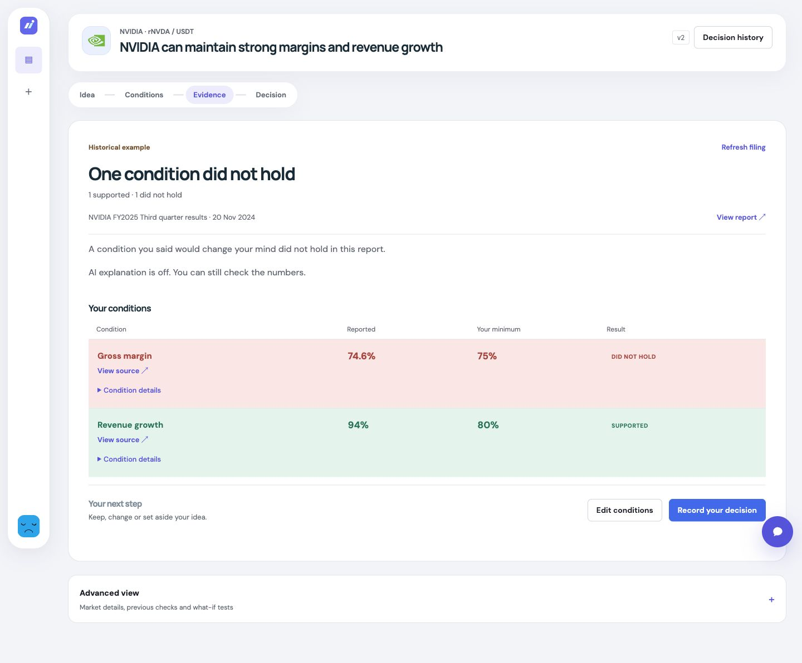

# Result-page polish — October 4, 2026

## Scope

User-approved local UI implementation. No paid AI request, account authorization, commit, push, AWS deployment, changes to normal SQLite data or work on the user-owned small study. Backend contracts, numerical comparisons, providers, AI prompts and ownership are unchanged.

| Always visible | Expand when needed |
| --- | --- |
| Plain result headline and separate condition counts | Longer AI explanation and next question |
| Report date and source link | Exact condition claim, saved explanation and rule |
| Reported value, confirmed minimum and saved condition state | Advanced view: market details, previous checks, older NVIDIA example, what-if tests, limits and technical metadata |
| Direct source links beside conditions | Source dialog: retrieval/hash/parser details |
| Missing/current-number warnings and failed/incomplete retrieval | Raw retrieval diagnostics and provider/model/prompt metadata |
| Historical example / What-if check label | Separate xStocks indicative USD and Bitget USDT context |
| Edit conditions, Record your decision and filing chat | xStocks requests wait until Market details opens |

Reported values are string representations from cited evidence. The UI neither recomputes the financial finding nor rounds an exact decimal into a different comparison. It uses the confirmed version attached to the saved assessment, not a later edited minimum. Zero remains zero, absent remains absent, and an uncited older metric is not promoted into the current comparison. Manual claims say “Needs your review” and show no artificial numerical floor.

The numerical outcome stays visible before, during and after AI annotation. A writing indicator now requires an actual pending request, rather than merely a configured provider. The existing auto-review and duplicate/budget guards are preserved. No new AI generation behavior was added.

## Verification

- 148 backend tests passed; Ruff check and format check passed (backend unchanged).
- 91 frontend tests passed, including 15 new presentation/interaction cases; TypeScript, production build and source/test Prettier passed.
- New cases cover direct comparisons/source clicks, zero and exact decimal strings, absent/uncited older numbers, manual conditions, assessed-version thresholds, optional gaps, authoritative saved states, publication-time ordering, UTC dates, all three evidence modes, keyboard expansion/additional citations, inactive results and lazy market loading with preserved metadata/limits.
- Existing integration assertions were updated to the new labels and locations, not removed. Current/failed retrieval, source selection, chat, decision navigation and pending/retry behavior remain covered.
- Browser: built frontend on loopback port 8034, blank Bitget/Groq keys, local identity and a fresh temporary SQLite database. Seeded the bundled historical NVIDIA Q3 result through normal draft/confirm/replay endpoints. The workspace's existing quote hook made read-only public Bitget market requests; they did not replace the saved historical assessment. No AI request or xStocks fetch occurred.
- Desktop at 1440px: four aligned comparison columns and direct citations. Source click opens the saved report; closing restores focus to that condition's source button. Advanced view exposes closed sub-sections. Reload preserves the saved historical result.
- Mobile at 390px and 320px: reported/minimum pairs and status remain readable; document width equals viewport width, with no horizontal overflow. Record your decision opens the unchanged human decision form, which also has no overflow at 390px. No decision was submitted.
- Temporary viewport overrides were reset and the disposable test server stopped after verification.

The preview intentionally shows historical evidence and an unconfigured AI provider, not a current market observation or new model-quality result.

## Desloppify

Used the installed Desloppify workflow before and after implementation on `apps/web`, with `status` and `next`. Backend was not rescanned because this is a frontend-only change. Only the existing dependency/build exclusions were used; no suppressions, wontfix decisions or subjective evidence were added. Scores are not hackathon grades or research accuracy.

| Web milestone | Overall lenient | Objective | Strict | Verified | Open |
| --- | ---: | ---: | ---: | ---: | ---: |
| Before | 21.2 | 84.9 | 19.1 | 84.9 | 74 |
| First implementation scan | 21.6 | 86.6 | 19.6 | 86.6 | 74 |
| Final | 21.6 | 86.5 | 19.6 | 86.5 | 73 |

| Mechanical dimension | Before health | Before strict | Final health | Final strict |
| --- | ---: | ---: | ---: | ---: |
| File health | 98.6 | 97.2 | 98.7 | 97.4 |
| Code quality | 96.4 | 94.7 | 96.5 | 95.0 |
| Duplication | 99.4 | 96.9 | 100.0 | 100.0 |
| Security | 100.0 | 100.0 | 100.0 | 100.0 |
| Test health | 50.8 | 23.7 | 55.1 | 27.2 |

All subjective dimensions remain unassessed, reported by the tool as zero at every milestone. `next` still requests initial subjective review; the repository cutoff plan excludes that independent review. It was not fabricated.

| Subjective dimension | Health | Strict |
| --- | ---: | ---: |
| Abstraction fit | 0 | 0 |
| AI-generated debt | 0 | 0 |
| API coherence | 0 | 0 |
| Authorization consistency | 0 | 0 |
| Contract coherence | 0 | 0 |
| Convention outlier | 0 | 0 |
| Cross-module architecture | 0 | 0 |
| Dependency health | 0 | 0 |
| Design coherence | 0 | 0 |
| Error consistency | 0 | 0 |
| High-level elegance | 0 | 0 |
| Incomplete migration | 0 | 0 |
| Initialization coupling | 0 | 0 |
| Logic clarity | 0 | 0 |
| Low-level elegance | 0 | 0 |
| Mid-level elegance | 0 | 0 |
| Naming quality | 0 | 0 |
| Package organization | 0 | 0 |
| Test strategy | 0 | 0 |
| Type safety | 0 | 0 |

The first implementation scan exposed two low-confidence test findings: a hardcoded provider URL and a return-only typed history fixture helper. The retrieval fixture now uses the instrument's own evidence source, eliminating the first. The cohesive history helper remains; its return-only body is intentional test setup, not an incomplete implementation. No finding was manually suppressed. No new production-code finding remains. Existing structural, type/coverage-heuristic and flat-directory findings remain. The 0.1 objective / 0.2 test-strict movement after removing unused UI props is disclosed, not optimized through artificial changes to the scanner inputs.

Non-fatal upstream TestClient deprecations, Node localStorage and Zod/Rollup annotation warnings remain, along with the existing >500KB JavaScript chunk warning (about 533KB minified / 164KB gzip). No formal accessibility certification, other browser engines, live Google login, model latency improvement or deployed walkthrough was claimed. Commit/push and production release require separate approval and restored non-root AWS access.
