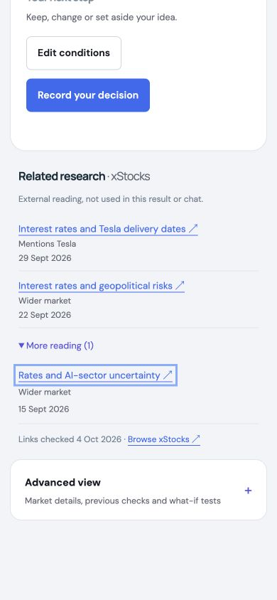

# xStocks reading and independent-pilot preparation — 4 October 2026

## Scope and outcome

Local implementation only, on top of preparation baseline
`9f93003361a9d6b48a9dcc576808c59b1a7eafde`. The changes remain uncommitted.

- The result page offers a compact xStocks reading list, two links initially,
  with additional links under More reading. Company mentions are issuer-scoped;
  wider-market reading is labelled. Qualifying links are newest first.
- Date-only publication is available the next UTC day. Links published after
  the saved assessment cutoff are absent, including on historical replays.
- This is manually checked external reading, not an automatically refreshed
  research feed. Article/PDF content is not fetched, copied into AI prompts,
  treated as company evidence, or included in chat/export. Findings are unchanged.
- The indicative xStocks price remains in Advanced view → Market details. The
  old generic research link in that price panel was removed.
- The [independent pilot pack](independent-pilot-01/README.md) contains 24 pending
  slots, not 24 independently selected cases or a completed benchmark. Sources,
  expected answers, reviewer attestations, evaluated commit and freeze hashes are
  deliberately blank. A bounded frozen runner remains to be implemented after
  source cases exist. The user-owned study was not conducted.
- [Content-permission requirements and an enquiry draft](../XSTOCKS_RESEARCH.md)
  are prepared. The enquiry was not sent. No paid AI requests, account
  authorisation, commit, push or deployment took place. No existing notebook,
  production account, secret or backend contract was changed.

## Verification

| Check | Outcome |
| --- | --- |
| Backend suite | 148 passed; two upstream TestClient/anyio deprecation warnings |
| Frontend suite | 104 passed across six test files |
| Ruff check and format check | Passed; 51 Python files formatted |
| Prettier | Passed |
| TypeScript | Passed after adding the missing stress-pending field to the new integration-test fixture |
| Production build | Passed; 252 modules, JS 536.00 kB / gzip 164.70 kB |
| Pilot JSON invariants | 24 unique pending IDs, six issuers, four distinct buckets each; no authorised requests; all run gates false; blank template non-runnable |
| Git whitespace check | Passed |

The existing Zod/Rollup annotation warnings, JavaScript chunk above 500 kB,
and Node localstorage-file warning remain. These are not hidden by changing
warning thresholds. Tests establish behavior, not general research accuracy.

New coverage exercises all six issuer selections, relevance and newest-first
ordering, next-UTC-day publication, invalid and historical cutoffs, issuer
switching, external-link safety, expansion, no provider fetch, and integration
outside Advanced view. The integration test preserves the input finding and
decision action and hides reading on the Decision tab without calling AI.

## Browser inspection

The production-built frontend was checked through a disposable loopback preview
on port 8035. It used a temporary SQLite notebook, an explicit local identity,
blank AI keys and an offline unavailable Bitget stub. Synthetic manual-condition
records were labelled as UI previews/what-if checks, not research-validation cases.
No source refresh or AI action was clicked.

The Tesla preview showed September 29 and September 22 reading first, with
September 15 under More reading. Enter on the native summary expanded it in the
real browser. At 390 × 844, document width was 390 and the reading section width
362, with readable links/dates and no horizontal overflow. At 1440 × 900,
document width was 1440 with dates aligned on the right and no overflow.
Only one Chromium-based browser was inspected; no Safari/Firefox claim is made.
Issuer switching and historical/Decision hiding are covered by component tests,
not claimed as additional live-browser checks.

The preview tab and temporary server ended before the final continuation.
Read-only process inspection confirmed the preview PID no longer existed; the
browser viewport override was reset. The user's normal notebook was untouched.

## Desloppify

Backend and `apps/web` were scanned separately, with status and next reviewed
before and after the change. Only dependency/build outputs were excluded from
the web scan. `.desloppify/` remains ignored. No findings were suppressed or
marked wontfix for this task.

| Project / scan | Overall | Objective | Strict | Verified | Open |
| --- | ---: | ---: | ---: | ---: | ---: |
| Backend before | 23.1 | 92.4 | 22.0 | 92.4 | 71 |
| Backend after | 23.1 | 92.4 | 22.0 | 92.4 | 71 |
| Web before | 21.7 | 86.8 | 20.1 | 86.8 | 69 |
| Web after | 21.8 | 87.2 | 20.3 | 87.2 | 71 |

All mechanical dimensions, health / strict:

| Dimension | Backend before | Backend after | Web before | Web after |
| --- | --- | --- | --- | --- |
| Code quality | 89.1 / 85.4 | 89.1 / 85.4 | 97.4 / 95.8 | 97.2 / 95.6 |
| Security | 98.8 / 96.5 | 98.8 / 96.5 | 100 / 100 | 100 / 100 |
| File health | 86.5 / 83.8 | 86.5 / 83.8 | 98.7 / 98.7 | 98.7 / 98.7 |
| Duplication | 100 / 100 | 100 / 100 | 100 / 100 | 100 / 100 |
| Test health | 87.9 / 76.9 | 87.9 / 76.9 | 55.1 / 33.1 | 56.4 / 35.2 |

Both scans still request an initial subjective review. The cutoff plan defers
that broader review; no invented assessment was imported. Each listed value is
the scanner's zero placeholder for **unassessed**, not a reviewer judgement that
the code deserves zero. Scores are not hackathon grades or research accuracy.

| Subjective dimension | Backend before/after | Web before/after |
| --- | --- | --- |
| Abstraction fit | 0 / 0 — unassessed | 0 / 0 — unassessed |
| AI-generated debt | 0 / 0 — unassessed | 0 / 0 — unassessed |
| API coherence | 0 / 0 — unassessed | 0 / 0 — unassessed |
| Authorization consistency | 0 / 0 — unassessed | 0 / 0 — unassessed |
| Contract coherence | 0 / 0 — unassessed | 0 / 0 — unassessed |
| Convention outlier | 0 / 0 — unassessed | 0 / 0 — unassessed |
| Cross-module architecture | 0 / 0 — unassessed | 0 / 0 — unassessed |
| Dependency health | 0 / 0 — unassessed | 0 / 0 — unassessed |
| Design coherence | 0 / 0 — unassessed | 0 / 0 — unassessed |
| Error consistency | 0 / 0 — unassessed | 0 / 0 — unassessed |
| High-level elegance | 0 / 0 — unassessed | 0 / 0 — unassessed |
| Incomplete migration | 0 / 0 — unassessed | 0 / 0 — unassessed |
| Initialization coupling | 0 / 0 — unassessed | 0 / 0 — unassessed |
| Logic clarity | 0 / 0 — unassessed | 0 / 0 — unassessed |
| Low-level elegance | 0 / 0 — unassessed | 0 / 0 — unassessed |
| Mid-level elegance | 0 / 0 — unassessed | 0 / 0 — unassessed |
| Naming quality | 0 / 0 — unassessed | 0 / 0 — unassessed |
| Package organization | 0 / 0 — unassessed | 0 / 0 — unassessed |
| Test strategy | 0 / 0 — unassessed | 0 / 0 — unassessed |
| Type safety | 0 / 0 — unassessed | 0 / 0 — unassessed |

The two additional open web findings concern five intentional static publisher
URLs in the central approved link catalog and a low-confidence time-unit
constant finding. The day duration is now explicitly named and expressed in
hours/minutes/seconds/milliseconds; the detector still flags its declaration.
Both findings remain open, with no dynamic URL construction or suppression to
improve a score. A comparator-less test sort was fixed and auto-resolved; the
price-panel test reuses its parsed fixture URL instead of duplicating it.
Existing large-file/test-health findings remain outside this focused change.
The Python scanner reported reduced security coverage because Bandit was not
available in its runtime. Its security number is not a full security audit.

## Next gates

1. The independent selector and verifier supply unfamiliar official source
   packets and agreed expectations. Do not label developer-picked cases as
   independent or fill in scores before a run.
2. Implement/test the offline snapshot runner, freeze exact inputs/code/prompts,
   then obtain separate approval for the proposed batch: 24 explanations plus
   six follow-ups, 30 first attempts and at most 60 requests including repairs.
3. Obtain written xStocks content permission or a licensed research feed before
   article/PDF ingestion and cited summaries/chat. The draft enquiry is ready
   for the user to send.
4. Commit/push and AWS deployment require separate approval; this report is not
   a claim that the live domain has changed.
